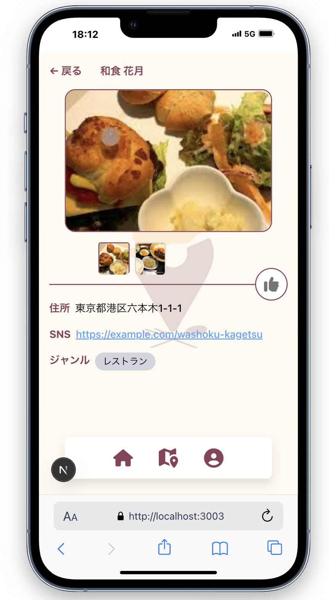

# アプリ概要
本アプリ「めしっぱら」は岐阜県各務原市を舞台とした地元飲食店のPRを目的としたアプリケーションです。 
2025年8月4日 ~ 8月9日の期間で企画立案から開発、プレゼンまで計6人で行いました。

### チーム構成（6名）
- **プロジェクトリーダー（1名）**: デザイン設計・フロントエンド開発
- **開発担当（1名）**: バックエンド・フロントエンド開発全般
- **デザイン・プレゼン資料担当（4名）**: UI/UXデザイン・プレゼン資料作成・フロントエンドスタイリング

## 私が取り組んだこと
私は開発担当としてバックエンドとフロントエンドの両方に携わりました。
### Backend開発
- **データベース設計**: Prismaスキーマを使用したテーブル設計とリレーション構築
- **認証システム**: Supabase Authを使用したメール/パスワード認証の実装
- **API開発**: Next.js API Routesを使用したRESTful APIの構築（ユーザー管理、店舗情報、検索機能など）
- **画像管理**: Supabase Storageを使用したプロフィール画像のアップロード・保存機能

### Frontend開発
- **フォーム実装**: React Hook Formを使用したユーザー登録・ログイン・プロフィール編集フォーム
- **状態管理**: カスタムフックを使用したAPI呼び出しとデータ管理
- **検索機能**: ジャンルに基づいた店舗検索と結果表示

## 技術スタック
</img>
</img>
</img>

### 技術スタック選定理由
#### Next.js
- **フルスタック開発**: フロントエンドとバックエンドをTypeScriptのみで統一開発可能
- **API Router**: RESTful APIの構築が簡単で、Server Actionsによるサーバーサイド処理も活用
- **パフォーマンス**: SSR/SSGによる最適化で高速なページ表示

#### Supabase
- **認証機能**: メール/パスワード認証を簡単に構築可能
- **ストレージ**: 画像アップロード機能を簡単に実装

## デモ画像
### ホーム画面、ログインページ

    </img>
    </img>

### ユーザー登録ページ

    </img>
    </img>

supabase Authを用いて認証機能を実装しました。

### topページ

    </img>
    </img>

今回の実装ではジャンルのみ検索結果に基づいて絞り込めるようにしました。

### 検索結果、詳細ページ

    </img>
    </img>

ジャンルに紐付いた結果表示が行えます。
topページや検索結果ページにある店舗をタップすることで詳細ページへと移ります。

### ユーザーページ

    </img>
    </img>

ユーザーのアイコンやユーザー名を変更できます。

##　今後の展望
- ユーザーのいいね機能、コメント機能
- 運営のおすすめ店舗紹介ページ
- 店舗登録の管理者ページ
- ユーザーのお問い合わせページ

## 開発で取り組めたこと
- 実装したい最低限の機能(ユーザー登録、topページ、詳細ページ、検索結果ページ)を絞り込んで実装できた点
- supabaseについて開発経験がなく、実装できるか不安であったが認証、ストレージなど実装できた点
- Next.jsやReactについて経験がない人にも任せれるタスクを決めて実装してもらったこと(ログインページや登録ページのスタイリング)

## 開発の反省点
### デザインと開発で認識に齟齬があった
開発1日目でアプリの概要や機能要件について話し合い、実装する内容について決めたつもりであったが 
デザインを見ると話し合ったこと以外の機能があったりするなどの問題があった

#### なぜそうなってしまったのか
１番の原因は**要件の詰めの甘さ**だと思いました。 
今回、チームの構成がデザイナー4人と開発者が2人ということもあり、私自身が開発フェーズに早く取り掛かってしまい、 
APIの仕様書や画面遷移図など設計を疎かにしてしまった結果、認識の齟齬につながると思いました。 

### チーム内のコミュニケーション不足
今回1週間(月~土)までに要件からプレゼンまで全て行う予定でしたが、 
月曜日以外メンバー全員集まれたことはなく、常に誰かが欠けている状況でした、 
その結果プロジェクトの進捗状況が遅くなってしまいました。

#### なぜそうなってしまったのか
このようになってしまった原因として**チーム運営の仕組み作りが不十分**だった点が挙げられます。 
集合時間や進捗報告などチームの中では明確なルールがなく、個人の判断に任せる形になってしまいました。 
その結果、Discordでのメンションに対するレスポンスがなかったり、無断欠席が続くなど、 
チームメンバーの参加意識に課題があり、プロジェクト全体の進捗状況がおそくなってしまいました

## 今後の改善点
- 仕様書を徹底してプロジェクトの認識を一致させる
- 定期的に話し合って進捗内容にズレがないか確かめる
- チーム全員が取り組む内容と役割を明確に定義する
- 参加意識を高めるための仕組み作り（定期的な進捗報告の義務化など）